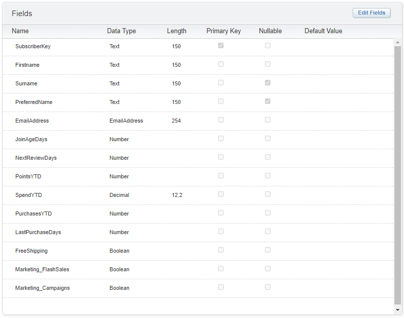

# Salesforce Marketing Cloud Exercise
## AMPscript IF Statements

### What is this
This is an AMPscript Exercise that I have developed to help new users to Marketing Cloud to better understand how AMPscript IF Statements work.
Through this Exercise you will learn a few common/basic methods of building IF Statements in a simulated marketing email.
Sample data is provided to ensure you can follow the tasks and reproduce the required outcomes. 

### How this exercise works
1. Firstly, make sure you have watched the introductory video here: [Introduction to If Statements in AMPscript](https://youtube.com/cameronrobert) 
2. Once you've learnt the basics on IF Statements in AMPscript, you can download the challenge brief here: [AMP-E01 IF Statements 1](AMP-E01%20IF%20Statements%201.pdf) 
3. The challenge will require the use of some sample data for the IF Statements, which you can download here: [AMP-E01.csv](AMP-E01.csv) 
4. Follow the instructions provided in the AMP-E01 brief, solving each task in order. 
5. If you get stuck and need help, you can watch me solve each of these tasks in this video: [AMPscript Exercise AMP-E01 - IF Statements 1](https://youtube.com/cameronrobert) 

### Sample Data Extension

**Field List:**
- SubscriberKey
- Firstname
- Surname
- PreferredName
- EmailAddress
- JoinAgeDays
- NextReviewDays
- PointsYTD
- SpendYTD
- PurchasesYTD
- LastPurchaseDays
- FreeShipping
- Marketing_FlashSales
- Marketing_Campaigns
 

### File List
- Video: [Introduction to If Statements in AMPscript](https://youtube.com/cameronrobert)
- Video: [AMPscript Exercise AMP-E01 - IF Statements 1](https://youtube.com/cameronrobert)
- Exercise Brief: [AMP-E01 IF Statements 1](AMP-E01%20IF%20Statements%201.pdf)
- Sample Data: [AMP-E01.csv](AMP-E01.csv)
